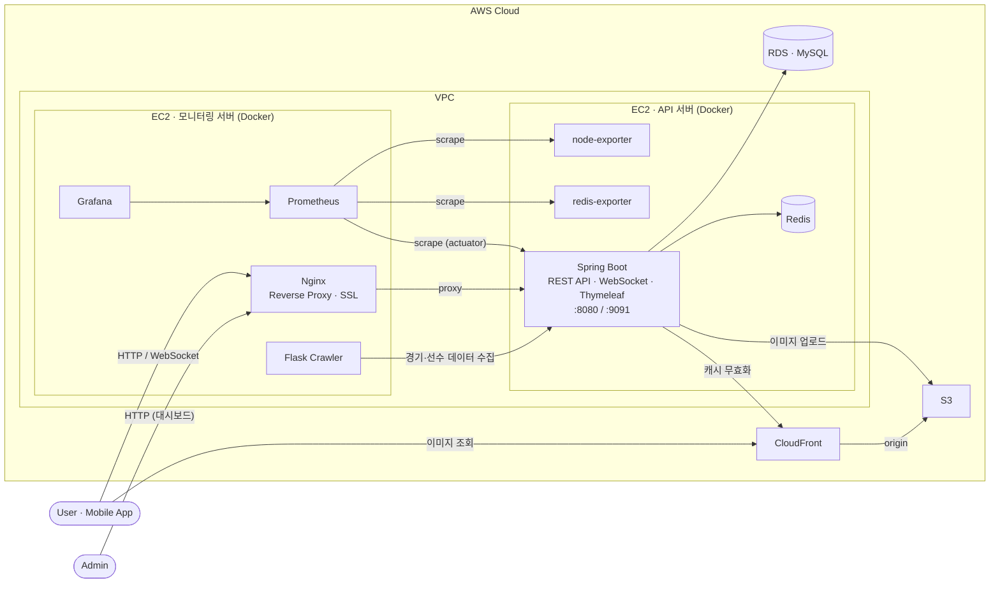

# FightWeek (파이트위크) — Backend

> UFC/MMA 팬을 위한 올인원 모바일 앱의 백엔드 서버
> 경기 일정·선수 정보 조회부터 경기 예측, 실시간 채팅, AI 경기 분석까지 한 곳에서 제공합니다.

[](https://apps.apple.com/kr/app/id6764522768)
[](https://play.google.com/store/apps/details?id=com.ht.fightweek)

- 🌐 서비스: https://fightweek.kr
- 📱 App Store: https://apps.apple.com/kr/app/id6764522768
- 🤖 Google Play: https://play.google.com/store/apps/details?id=com.ht.fightweek
- ▶️ 소개 영상: https://www.youtube.com/watch?v=IMDCsDtsfMc

---

## 목차

- [기술 스택](#기술-스택)
- [서비스 아키텍처](#서비스-아키텍처)
- [애플리케이션 구조](#애플리케이션-구조)
- [주요 기능](#주요-기능)
- [패키지 구조](#패키지-구조)
- [인프라 & 배포](#인프라--배포)
- [모니터링](#모니터링)
- [로컬 실행](#로컬-실행)
- [테스트](#테스트)

---

## 기술 스택

| 구분 | 사용 기술 |
|------|-----------|
| **Language / Runtime** | Java 21 (Amazon Corretto) |
| **Framework** | Spring Boot 3.5.3, Spring MVC, **Spring WebFlux (SSE)** |
| **Persistence** | Spring Data JPA, MySQL, Flyway, H2 (test) |
| **Cache / In-memory** | Redis (Spring Data Redis), Spring Cache (`@Cacheable`) |
| **Auth** | Spring Security, OAuth2 Client, JWT (jjwt) |
| **Realtime** | WebSocket (Handler 기반), Server-Sent Events |
| **AI** | Spring AI (OpenAI) |
| **Push / Mail** | Firebase Admin (FCM), Spring Mail (SMTP) |
| **Cloud** | AWS S3, CloudFront, ECR, EC2 |
| **Observability** | Spring Actuator, Micrometer, Prometheus, Grafana |
| **View (Admin)** | Thymeleaf |
| **Infra** | Docker, GitHub Actions, Nginx |

---

## 서비스 아키텍처

운영 환경은 **API 서버**와 **모니터링 서버**를 별도 EC2로 분리해, 모니터링 부하가 서비스에 영향을 주지 않도록 구성했습니다.
공개 트래픽은 모니터링 서버의 Nginx(Reverse Proxy)를 통해 API 서버로 전달되며, Prometheus가 각 Exporter와 애플리케이션 메트릭을 수집해 Grafana로 시각화합니다.



배포는 `master` push 시 GitHub Actions가 빌드 → ECR 푸시 → EC2 SSH 배포까지 자동 수행합니다. 자세한 내용은 [인프라 & 배포](#인프라--배포)를 참고하세요.

---

## 애플리케이션 구조

애플리케이션은 **사용자용 API**와 **운영용 Admin**을 패키지 레벨에서 분리하고,
공통 관심사(인증·캐시·외부 연동 등)는 `api/global`에 응집시켰습니다.

```
my.mma
├── api      # 모바일 앱이 호출하는 사용자 대상 REST API
│   └── global   # 인증·Redis·S3·AI·FCM 등 횡단 관심사(cross-cutting)
└── admin    # Thymeleaf 기반 운영자(관리자) 웹 + 데이터 관리/정산
```

핵심 도메인(사용자·경기·예측)과 운영성 도메인(채팅 신고·문의 등)을 결합도 기준으로 분리하고,
영속성이 불필요하거나 무결성 비중이 낮은 데이터는 **Redis**로 옮겨 주요 도메인과 느슨하게 결합했습니다.

---

## 주요 기능

### 사용자 API (`api`)

| 도메인 | 설명 |
|--------|------|
| **user / security** | OAuth2 소셜 로그인, JWT 발급·재발급, 회원/마이페이지, 탈퇴 사유 수집 |
| **fightevent** | 이번 주/예정 UFC 경기 카드 및 일정 조회 |
| **fighter** | 선수 프로필·전적·커리어 스탯 조회, 선수 랭킹, 선수 호감도(Rating) |
| **bet** | 경기 예측(포인트 베팅), 베팅 취소, 픽률 집계 — *동시성/무결성 제어 적용* |
| **game** | 선수·경기 기반 이름 맞히기 퀴즈 (`@Cacheable(sync=true)`로 생성 최적화) |
| **stream** | WebSocket 실시간 채팅 + 경기 변동 반영, **AI 경기 분석 답변 SSE 스트리밍** |
| **alert** | 선수/주간 경기 알림 (FCM 푸시, 스케줄러 기반 발송) |
| **announcement / faq / inquiry / report** | 공지·FAQ·1:1 문의·신고 등 운영성 기능 |
| **smtp / status** | 이메일 인증, 앱 점검/상태 안내 |

### AI 경기 분석 (`api/global/ai`)

- Spring AI + WebFlux(SSE)로 LLM 분석 답변을 **실시간 토큰 스트리밍**
- 답변은 `cacheKey`(event/fight/fighter + question) 기준 **Redis 캐싱** — 히트 시 1개 이벤트로 즉시 응답
- **DB 최신 데이터를 프롬프트에 주입(grounding)** 하고, 없는 수치는 생성하지 못하게 제약을 두어 환각 최소화

### 운영자 Admin (`admin`)

- 선수·경기 데이터 관리 및 메인 도메인 동기화(`sync`)
- 미정산 베팅 정산 처리(`UnsettledBetProcess`)
- 실시간 스트림(경기 변동) 관리, 공지·FAQ·문의·신고·유저 관리, 앱 상태 제어

### 배치 / 스케줄러

| 스케줄러 | 역할 |
|----------|------|
| `UserRankingInitializeScheduler` | 사용자 랭킹 초기화 |
| `GameCacheEvictScheduler` | 퀴즈 데이터 캐시 무효화 |
| `FightPickCountScheduler` | 경기 픽 카운트 집계 |
| `FighterNotificationService` / `WeeklyFightEventNotificationService` | 선수/주간 경기 알림 발송 |

---

## 패키지 구조

```
src/main/java/my/mma
├── MmaApplication.java
├── api
│   ├── alert / announcement / bet / faq / fighter / fightevent
│   ├── game / home / inquiry / report / smtp / status / stream / user
│   ├── security        # OAuth2, JWT 재발급
│   ├── exception       # 전역 예외 처리
│   ├── init            # 초기 데이터 적재
│   └── global
│       ├── ai          # Spring AI 챗봇 (ChatClient, 캐싱)
│       ├── redis       # RedisConfig, CacheManager, Key 관리
│       ├── s3          # S3 업로드 + CloudFront
│       ├── fcm         # Firebase Cloud Messaging
│       ├── logaop      # @Loggable AOP 로깅
│       ├── resolver    # 인증 ArgumentResolver
│       ├── config      # JPA Auditing, 동시 접속자 메트릭 등
│       └── utils
└── admin
    ├── web             # 관리자 컨트롤러(Thymeleaf)
    ├── event / stream  # 실시간 경기 이벤트 처리
    └── handler         # 관리자 예외 처리

각 도메인은 controller / service / repository / entity / dto 계층으로 구성됩니다.
```

---

## 인프라 & 배포

`master` 브랜치에 push되면 GitHub Actions가 빌드 → 이미지 푸시 → EC2 배포까지 자동 수행합니다.

```
GitHub push (master)
   └─ GitHub Actions
        ├─ ./gradlew clean build      # 빌드 (secrets로 application.yml 주입)
        ├─ docker build & push → AWS ECR
        └─ SSH → EC2 → ./deploy-spring.sh
```

운영 환경은 **API 서버**와 **모니터링 서버**를 분리해 구성합니다.

| Compose 파일 | 구성 |
|--------------|------|
| `docker-compose.api.prod.yml` | Spring Boot · Redis · redis-exporter · node-exporter |
| `docker-compose.monitoring.prod.yml` | Nginx(Reverse Proxy, SSL) · Prometheus · Grafana · Flask |

> Nginx는 별도 모니터링 서버에서 동작하며, API 서버 연결 실패를 감지하면 즉시 점검 안내 응답을 반환해
> 장애 상황에서도 사용자 대기 시간을 최소화합니다.

---

## 모니터링

- **Node Exporter** — EC2 호스트 리소스(CPU/메모리/디스크)
- **Redis Exporter** — Redis 메모리 사용량·연결 수
- **Micrometer Gauge** — WebSocket 동시 접속자 수 등 비즈니스 메트릭
- **Prometheus + Grafana** — 위 지표를 수집·시각화하여 JVM·Redis·EC2·실시간 접속자를 한 화면에서 관찰
- **Slack 알림** — Grafana Alerting이 Prometheus 메트릭 임계치를 평가해 Slack 채널로 경보 발송
  - JVM 힙 사용률 **80% 초과**
  - DB 커넥션 풀(HikariCP, max 8) **임계치 도달**

---

## 로컬 실행

### 사전 요구사항

- JDK 21
- Redis (로컬 또는 Docker)
- MySQL (또는 H2로 대체)

### 설정 파일

`application.yml`, `application-prod.yml` 등 민감 설정은 `.gitignore` 처리되어 있습니다.
로컬 실행 시 `src/main/resources/`에 아래 키들을 채운 설정 파일을 직접 생성해야 합니다.

```yaml
spring:
  datasource:    # MySQL 접속 정보
  data:
    redis:       # Redis 호스트/포트
  ai:
    openai:
      api-key:   # OpenAI API Key
# + AWS(S3/CloudFront), Firebase, OAuth2, JWT secret 등
```

### 실행

```bash
./gradlew bootRun
# 또는
./gradlew clean build && java -jar build/libs/mma-0.0.1-SNAPSHOT.jar
```

### Docker (개발용)

```bash
docker-compose -f docker-compose-dev.yml up
```

---

## 테스트

JUnit 5 + Mockito 기반으로 서비스 단위 테스트와 컨트롤러/리포지토리 통합 테스트를 작성했습니다.
테스트는 H2(MySQL 호환 모드) 위에서 실행됩니다.

```bash
./gradlew test
```

```
src/test/java/my/mma
├── api/{bet, fighter, fightevent, game, report, smtp, user}   # 도메인별 service/controller/repository 테스트
├── admin/event/service
└── fixture                                                    # 테스트 픽스처(엔티티/DTO 빌더)
```
